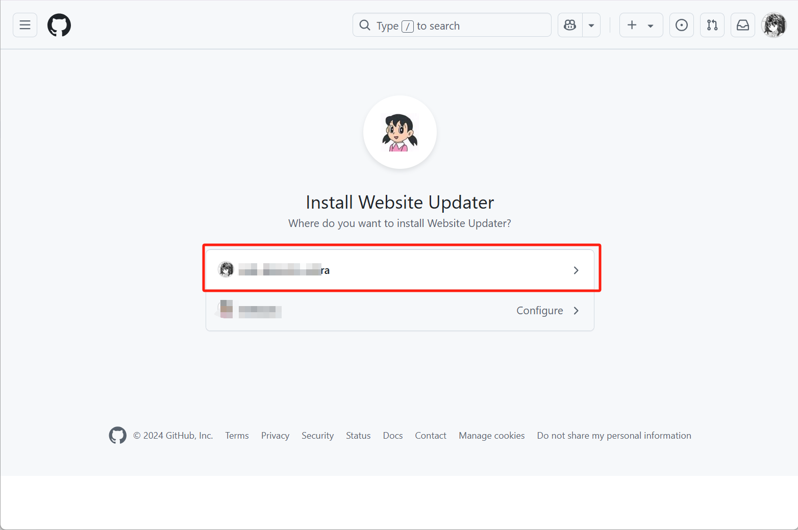
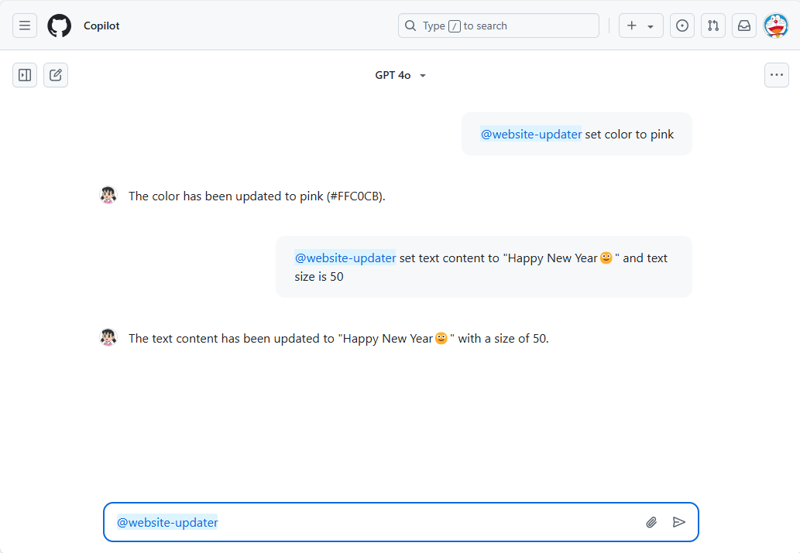

# Create Interactive Copilot Skillset

| **Version** | **Update Notes** | **Date** |
| ----------- | ---------------- | -------- |
| 1.0    | create           | 20241231 |
| 1.1    | update doc           | 20250101 |

## Table of contents

- [Why Built This](#Why-Built-This)
- [Quick Try](#Quick-Try)
  - [Install GitHub App in your GitHub Account](#Install-GitHub-App-in-your-GitHub-Account)
  - [Use the Skillset-Type Extension](#Use-the-Skillset-Type-Extension)
- [Create Your Own Skillset](#Create-Your-Own-Skillset)
  - [Key Features](#Key-Features)
  - [Deploy Backend Service](#Deploy-Backend-Service)
    - [Source Code Mode](#Source-Code-Mode)
    - [Docker Mode](#Docker-Mode)
  - [Create GitHub App](#Create-GitHub-App)
    - [General](#General)
    - [Permissions & events](#Permissions--events)
    - [Copilot](#Copilot)
    - [Install App](#Install-App)
  - [Try Your Own Skillset](#Try-Your-Own-Skillset)
- [Congratulations](#Congratulations)


# Why Built This

[GitHub released support for Skillset-type Copilot Extensions](https://github.blog/changelog/2024-11-19-build-copilot-extensions-faster-with-skillsets/) in November 2024. According to the release blog:

> While Agents-type Extensions offer full control over the user interaction, Skillset make it easy to integrate external tools and services into Copilot Chat by defining simple API endpoints – no AI expertise needed!

Very cool, but also quite confusing. Therefore, I created the project [**Copilot Skillset Demo**](https://github.com/satomic/copilot-skillset-demo) to let people intuitively experience the convenience and power of Skillset.

# Quick Try

I've created a public GitHub App [**Website Updater**](https://github.com/apps/website-updater) based on this project that you can install in your account and try it out.

## Install GitHub App in your GitHub Account

1. Visit [**Website Updater**](https://github.com/apps/website-updater), click **Configure**.

   
2. **Continue** with the account that you wanna install it.

   
3. Click the account again.

   
4. **Install**.

   
5. install successfully.

   

## Use the Skillset-Type Extension

1. Click the Copilot Icon in the top-right of the GitHub.com

   
2. Now you can trigger the Skillset with @ now

   
3. Before use the Skillset, visit [demo.softrin.com/skillset](https://demo.softrin.com/skillset).

   
4. Then use the Skillset to update the color and text.

   
5. Refresh [demo.softrin.com/skillset](https://demo.softrin.com/skillset), we can see the website is updated successful.

   
6. Backend log
   ```bash
   2024-12-31 13:46:54,216 - [INFO] - 127.0.0.1 - - [31/Dec/2024 13:46:54] "GET /skillset HTTP/1.1" 200 -
   2024-12-31 13:50:25,704 - [INFO] - Color route
   2024-12-31 13:50:25,933 - [INFO] - Trigger from GitHub Extension, Color: #00FF00
   2024-12-31 13:50:25,934 - [INFO] - 127.0.0.1 - - [31/Dec/2024 13:50:25] "POST /color HTTP/1.1" 200 -
   2024-12-31 13:51:10,941 - [INFO] - Text route
   2024-12-31 13:51:11,432 - [INFO] - Trigger from GitHub Extension, User: ********, Content: How are you?, Size: 120
   2024-12-31 13:51:11,432 - [INFO] - 127.0.0.1 - - [31/Dec/2024 13:51:11] "POST /text HTTP/1.1" 200 -
   2024-12-31 13:51:22,104 - [INFO] - Skillset route
   2024-12-31 13:51:22,104 - [INFO] - 127.0.0.1 - - [31/Dec/2024 13:51:22] "GET /skillset HTTP/1.1" 200 -
   ```

# Create Your Own Skillset

## Key Features

- This repo can [verify that payloads are coming from GitHub](https://docs.github.com/en/copilot/building-copilot-extensions/building-a-copilot-agent-for-your-copilot-extension/configuring-your-copilot-agent-to-communicate-with-github#verifying-that-payloads-are-coming-from-github), will protect your backend's security and privacy.
- Get information about the GitHub user who called this Skillset.

## Deploy Backend Service

Repo link: [Copilot Skillset Demo](https://github.com/satomic/copilot-skillset-demo).

### Source Code Mode

1. Download source code
   ```bash
   git clone https://github.com/satomic/copilot-skillset-demo.git
   ```
2. Install requirements
   ```bash
   pip install -r requirements.txt
   ```
3. Run
   ```bash
   python3 main.py
   ```
4. Publish this service, it should be [publicly accessible via HTTPS](https://docs.github.com/en/copilot/building-copilot-extensions/building-a-copilot-skillset-for-your-copilot-extension/building-copilot-skillsets#prerequisites). The easiest way is using **VSCode Ports Forwarding** (you can use anyway you like). Remember set the **Visibility** to **Public**.

   

### Docker Mode

1. Download source code in to a Linux with docker installed.
2. Build docker
   ```bash
   bash docker_build.sh
   ```
3. Run docker (I published my docker image `satomic/skillset:20241231` already, you can just use it directly).
   ```bash
   docker run -itd \
   --net=host \
   --restart=always \
   --name skillset \
   -v /srv/skillset-logs:/app/logs \
   satomic/skillset:20241231 # change this to your own image
   ```
4. You need to fix the HTTPS problem by yourself 🙂. Because backend service should be [publicly accessible via HTTPS](https://docs.github.com/en/copilot/building-copilot-extensions/building-a-copilot-skillset-for-your-copilot-extension/building-copilot-skillsets#prerequisites).

## Create GitHub App

1. Visit [New GitHub App](https://github.com/settings/apps/new), fill in the necessary information.

### **General**

1. **Basic information**

   
2. **Webhook**

   

### Permissions & events

1. **Account permissions**

   
2. **Copilot Chat** - **Ready-only**

   

### Copilot

1. **App Type** - **Skilset**

   
2. **Skill definitions**
   1. **color**
      - Name: `color`
      - Inference description: `set color`
      - URL: you need to use your own URL, if you are using VSCode Ports Forwarding, it should be like `https://2npk0g6z-8081.asse.devtunnels.ms/color`
      - Parameters:
        ```json
        {
          "type": "object",
          "properties": {
            "hex_color": {
              "type": "string",
              "description": "The color is in hex format, for example: #0FFFFF."
            }
          }
        }
        ```
        
   2. **text**
      - Name: `text`
      - Inference description: `set content and size of text`
      - URL: you need to use your own URL, if you are using VSCode Ports Forwarding, it should be like `https://2npk0g6z-8081.asse.devtunnels.ms/text`
      - Parameters:
        ```json
        {
          "type": "object",
          "properties": {
            "content": {
              "type": "string",
              "description": "Text content displayed on the web page"
            },
          "size": {
              "type": "number",
              "description": "The size of the text displayed on the web page"
            }
          }
        }
        ```
        

### Install App

1. Install App in your account.

   

## Try Your Own Skillset

1. Check your own website, it should be the address with `/skillset` added to your published service URL, if you use VSCode Ports Forwarding, it should be `https://2npk0g6z-8081.asse.devtunnels.ms/skillset`. And the default website looks like:

   
2. Visit [Copilot in GitHub.com](https://github.com/copilot), use @ to trigger the Skillset

   
3. update the website with natural language.

   
4. refresh the website.

   
5. You can also use it in your IDEs
   1. VSCode

      
   2. JetBrains IDEs

      

# Congratulations

Now you have learned how to create an interactive Skillset-type Copilot extension.
